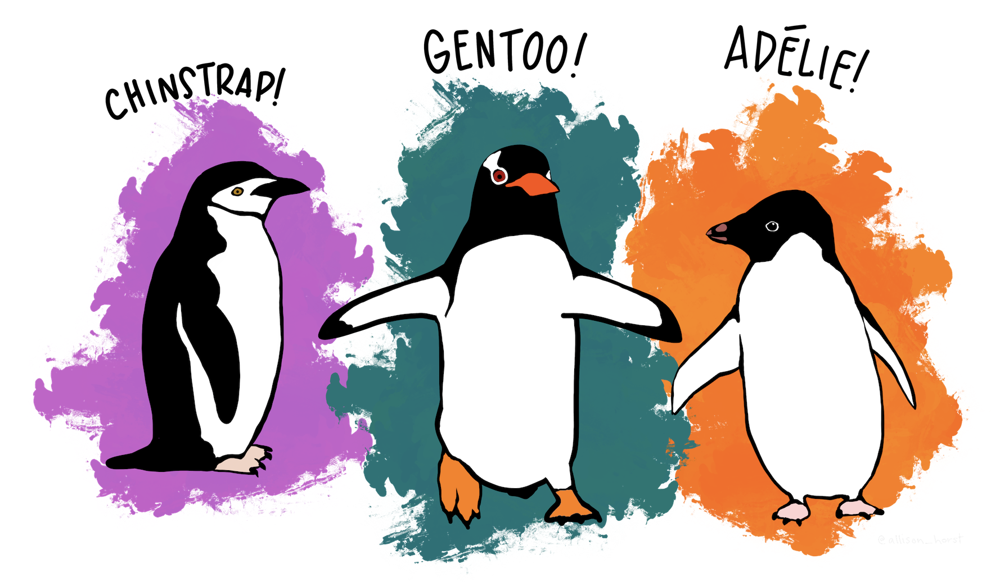

# Hello, Penguins
 Machine learning experiments with the Palmer Penguins dataset

 

*Illustration by @allison_horst*

## Welcome
Welcome to the “Hello Penguins” repository, a collection of machine learning experiments with the Palmer Penguins dataset. 

Following the “Hello, World!” programming tradition, each experiment includes sanity checks to verify the model predictions make sense and are explainable.

To learn more about the dataset, checkout the the official [Palmer Penguins GitHub repo](https://github.com/allisonhorst/palmerpenguins/blob/main/README.md).

## Technology 
MLflow is used for model training and evaluation instead of notebooks. 

Training happens locally and the experiment results are shared in an [MLflow portfolio](https://hello-penguins-981081086626.us-central1.run.app/#/) that is hosted with Google Cloud Run. The goal is to have the portfolio highly available, but there may be times when it is offline.  The portfolio Docker container files are in the [docker-portfolio](/docker-portfolio/) directory. 

## Pre-Training Checks
* Check the data for bias

## Acknowledgements and Sources

### This repo builds on many foundations:

* Allison Horst’s [Palmer Penguins repo](https://github.com/allisonhorst/palmerpenguins/blob/main/README.md) 
* Lynn Langit’s mentorship and amazing resources for [learning cloud](https://github.com/lynnlangit/learning-cloud) 
* Santiago Valdarrama’s [ML School repo](https://github.com/svpino/ml.school)

